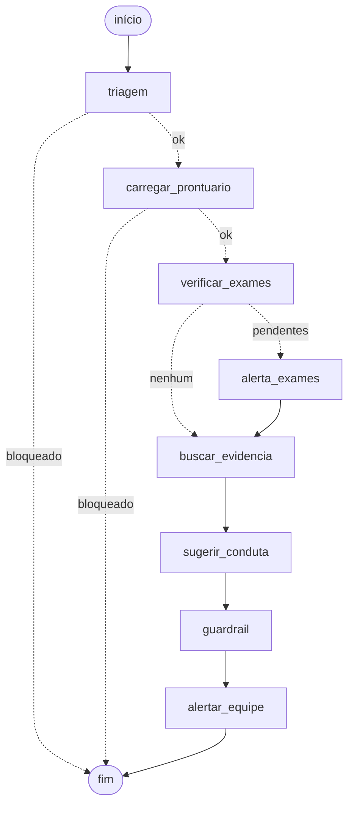

# Relatório Técnico — Assistente Médico com LLM Fine-tunada

**Tech Challenge — Fase 3 | Pós-Tech IA para Devs**

> **Aviso**: sistema acadêmico de apoio à decisão clínica. Não substitui
> julgamento médico e nunca emite prescrições sem validação humana.

---

## Sumário

1. [Visão geral](#1-visao-geral)
2. [Dados: origem, anonimização e curadoria](#2-dados)
3. [Fine-tuning da LLM](#3-fine-tuning)
4. [Avaliação do modelo](#4-avaliacao)
5. [O assistente médico](#5-assistente)
6. [Fluxo de decisão automatizado](#6-fluxo)
7. [Segurança, auditoria e explainability](#7-seguranca)
8. [Testes automatizados](#8-testes)
9. [Limitações e trabalhos futuros](#9-limitacoes)
10. [Como reproduzir](#10-reproduzir)

---

<a name="1-visao-geral"></a>
## 1. Visão geral

O sistema é um assistente virtual de apoio à decisão clínica que responde
perguntas de médicos combinando três fontes distintas:

| Fonte | Papel | Implementação |
|---|---|---|
| LLM fine-tunada | Raciocínio clínico no formato veredito + justificativa | QLoRA sobre `Qwen2.5-1.5B-Instruct` |
| Evidência científica | Fundamentação factual, com PMID rastreável | RAG com Chroma + `all-MiniLM-L6-v2` |
| Prontuário do paciente | Contextualização com dados atualizados | SQLite com dados sintéticos |

A orquestração usa **LangChain** (pipeline linear de pergunta e resposta) e
**LangGraph** (fluxo de decisão com desvios condicionais e alertas). Toda
resposta passa por guardrails programáticos e é registrada numa trilha de
auditoria.

### Decisão de arquitetura: por que fine-tuning **e** RAG

As duas técnicas resolvem problemas diferentes e foram combinadas de
propósito:

- O **fine-tuning** ensina *formato e comportamento*: responder com veredito
  estruturado, manter o tom clínico e reconhecer evidência inconclusiva.
  Não é um mecanismo confiável para armazenar fatos — conhecimento embutido
  nos pesos não tem fonte citável e envelhece.
- O **RAG** fornece *fatos verificáveis e atualizáveis*, com o PMID de
  origem. Indexar um novo protocolo custa segundos; retreinar o modelo,
  horas.

Usar apenas fine-tuning produziria respostas fluentes e sem fonte — o pior
cenário num contexto médico, onde a confiança precisa ser auditável.

### Escolha do modelo base

`Qwen/Qwen2.5-1.5B-Instruct` foi escolhido por caber, com QLoRA, na GPU T4
de 16 GB do Colab gratuito, mantendo bom desempenho em inglês técnico
(idioma do PubMedQA) e trazendo chat template nativo. Modelos maiores
(LLaMA-8B, Falcon-7B) exigiriam hardware fora do orçamento do projeto sem
ganho proporcional numa tarefa majoritariamente de classificação com
justificativa.

---

<a name="2-dados"></a>
## 2. Dados: origem, anonimização e curadoria

### Dataset

**PubMedQA (PQA-L)** — 1.000 pares de pergunta/contexto/resposta extraídos
de publicações médicas, com rótulo `yes`/`no`/`maybe` e conclusão textual.
Foi preferido ao MedQuAD por trazer o **contexto científico junto da
resposta**, o que permite treinar o modelo a *fundamentar* a conclusão em
vez de apenas recitá-la, e por oferecer o PMID, essencial para a
explainability.

### Pipeline de preprocessing

Executado por `src/preprocessing/`, nesta ordem:

1. **Normalização** Unicode NFKC e remoção de caracteres de controle.
2. **Anonimização** (`anonymizer.py`) — pseudonimização por placeholders
   tipados, preservando a semântica clínica: e-mail, URL, CPF, CNS,
   telefone, MRN/prontuário, datas completas, nomes precedidos de título
   clínico e **idade ≥ 90 anos** (identificador indireto sob HIPAA Safe
   Harbor).
3. **Curadoria** por tamanho mínimo de resposta e contexto, validade do
   rótulo e limite máximo de contexto.
4. **Deduplicação** por SHA-256 do par pergunta+contexto.
5. **Split estratificado** por rótulo, com seed fixa (42).

### Resultados da preparação

| Métrica | Valor |
|---|---|
| Exemplos brutos | 1.000 |
| Exemplos após curadoria | 1.000 |
| Distribuição | `yes` 552 / `no` 338 / `maybe` 110 |
| PII substituída | 10 datas, 1 URL |
| Média de caracteres do contexto | 1.379 |
| Split | 799 treino / 99 validação / 102 teste |

O volume baixo de PII é esperado: o PubMedQA é composto por abstracts
científicos, já despersonalizados na origem. A etapa foi mantida porque o
pipeline precisa ser seguro quando alimentado com **documentos internos do
hospital**, esse sim o cenário de risco real — e porque a ausência de
achados só pode ser afirmada depois de verificar.

O dataset é **desbalanceado** (55% `yes`, 11% `maybe`), fato que determina a
escolha da métrica de avaliação na seção 4.

---

<a name="3-fine-tuning"></a>
## 3. Fine-tuning da LLM

### Técnica: QLoRA

Treinar todos os 1,5 bilhão de parâmetros exigiria dezenas de GB de VRAM.
O **QLoRA** combina duas ideias para caber em 16 GB:

- **Quantização NF4**: os pesos do modelo base são guardados em 4 bits e
  permanecem **congelados**.
- **LoRA**: em vez de alterar os pesos originais, treinam-se matrizes de
  baixo posto adicionadas a certas camadas. Apenas ~1% dos parâmetros
  recebe gradiente, e o artefato final tem ~70 MB em vez de ~3 GB.

### Hiperparâmetros

Definidos em `src/config.py`:

| Parâmetro | Valor | Justificativa |
|---|---|---|
| LoRA `r` / `alpha` | 16 / 32 | Razão 1:2, padrão que equilibra capacidade e overfitting |
| `target_modules` | atenção (q,k,v,o) + MLP (gate,up,down) | Adaptar só a atenção limita o ganho em tarefas de conteúdo |
| `lora_dropout` | 0.05 | Regularização leve, dataset pequeno |
| Batch efetivo | 16 (2 × 8 acumulação) | Maior batch não cabe na T4 |
| Learning rate | 2e-4, scheduler cosine | LR típico de LoRA, ~10× o de fine-tuning completo |
| Otimizador | `paged_adamw_8bit` | Estados do otimizador em 8 bits, evita OOM |
| Épocas | 3 | Com early selection pelo melhor checkpoint |
| `max_seq_length` | 2048 | Cobre o p95 do comprimento dos exemplos |

### Detalhe decisivo: `assistant_only_loss=True`

A loss é calculada **apenas sobre os tokens da resposta**, não sobre o
prompt. Sem isso o modelo gastaria capacidade aprendendo a reproduzir o
abstract de entrada — que ele nunca precisa gerar — em vez de aprender a
decidir o veredito. É o tipo de detalhe que não gera erro, apenas um
resultado silenciosamente pior.

### Execução e seleção do checkpoint

Treino realizado no Google Colab (GPU T4 16 GB), ~45 s/step, ~1h50 no
total para 150 steps. A lentidão vem da soma de dequantização 4-bit,
gradient checkpointing e ausência de suporte a bf16 na T4.

A configuração usa `load_best_model_at_end` com `eval_loss` como critério.
O checkpoint selecionado foi o da **época 2**:

| Métrica (melhor checkpoint) | Valor |
|---|---|
| `eval_loss` | 1.527 |
| `eval_mean_token_accuracy` | 0.649 |
| `eval_entropy` | 1.431 |
| Época | 2 de 3 |

O fato de a melhor época não ser a última confirma o **overfitting na
terceira época**, comportamento esperado com apenas 799 exemplos de treino.
A seleção automática pelo menor `eval_loss` evitou entregar um modelo pior
do que o disponível.

<!-- TODO: inserir docs/loss_curve.png (célula 5.1 do notebook de fine-tuning) -->

---

<a name="4-avaliacao"></a>
## 4. Avaliação do modelo

### Metodologia

Comparação **modelo base vs. fine-tunado** sobre os 102 exemplos do
conjunto de teste, nunca vistos no treino. Geração determinística
(`do_sample=False`) para garantir reprodutibilidade.

### Métricas e por que estas

| Métrica | O que mede | Por que importa aqui |
|---|---|---|
| **F1 macro** | Média do F1 por classe, sem peso por frequência | **Métrica principal.** O dataset tem 55% de `yes`: um modelo que sempre responde "yes" atinge 55% de acurácia com F1 macro de apenas ~0,24. A acurácia sozinha esconderia esse colapso |
| Acurácia | Fração de vereditos corretos | Comparabilidade com a literatura |
| F1 por classe | Desempenho em `yes`/`no`/`maybe` | `maybe` (11%) é a classe difícil e clinicamente relevante: representa a evidência inconclusiva |
| ROUGE-L | Sobreposição da justificativa com a conclusão de referência | Verifica se o modelo fundamenta, não apenas acerta o rótulo |
| Taxa não parseável | Respostas sem veredito extraível | Mede a aderência ao formato — o modelo base tende a divagar |

### Resultados

<!-- TODO: preencher com docs/evaluation_results.json (célula 6 do notebook de demo) -->

| Métrica | Base | Fine-tuned | Δ |
|---|---|---|---|
| F1 macro | — | — | — |
| Acurácia | — | — | — |
| F1 (`yes`) | — | — | — |
| F1 (`no`) | — | — | — |
| F1 (`maybe`) | — | — | — |
| ROUGE-L | — | — | — |
| Taxa não parseável | — | — | — |

### Análise

<!-- TODO: escrever após a execução. Pontos a cobrir:
     - ganho em F1 macro e, principalmente, onde ele se concentra
     - comportamento na classe `maybe` (a mais difícil e a mais escassa)
     - queda da taxa não parseável: efeito esperado do fine-tuning,
       que ensina formato antes de conteúdo
     - leitura honesta da matriz de confusão: para onde vão os erros
     - o que o resultado NÃO prova (ver seção 9) -->

---

<a name="5-assistente"></a>
## 5. O assistente médico

### Componentes

```
src/app/llm.py       carrega a LLM customizada como componente LangChain
src/app/chain.py     pipeline: pergunta → contexto → evidência → resposta
src/app/ui.py        interface Streamlit de demonstração
src/db/patients.py   base estruturada de pacientes (SQLite, sintética)
src/rag/             banco vetorial Chroma e retriever
```

### Base estruturada de pacientes

O PubMedQA fornece evidência científica, não prontuários. Para atender ao
requisito de "consultas em base de dados estruturadas" e
"contextualização com informações atualizadas do paciente", foi criada uma
base SQLite com **20 pacientes sintéticos** gerados de forma determinística
(seed fixa): diagnóstico, setor, exames com status pendente/concluído,
medicações ativas e alergias.

Nenhum dado real de paciente é utilizado. O seed é versionado em
`data/patients_seed.json` e a base é regenerável com um comando.

### Pipeline LangChain

`ask(pergunta, patient_id)` executa:

1. Guardrail de entrada (sanitização de PII, verificação de escopo).
2. Consulta ao prontuário no SQLite, se houver paciente.
3. Recuperação dos *k* trechos mais relevantes no Chroma.
4. Montagem do prompt com pergunta + prontuário + evidência numerada e
   prefixada com o PMID.
5. Geração pela LLM fine-tunada.
6. Guardrail de saída e registro na auditoria.

O retorno é estruturado — resposta, fontes e `trace_id` — e não apenas
texto.

### Interface

`streamlit run src/app/ui.py` exibe, numa tela: caminho percorrido no
grafo, alertas por nível de severidade, resposta, guardrails acionados,
fontes com link direto para o PubMed e a trilha de auditoria da execução.

---

<a name="6-fluxo"></a>
## 6. Fluxo de decisão automatizado

### Por que um grafo, e não apenas uma chain

A chain é uma linha reta: pergunta → busca → LLM → resposta. O enunciado
pede que o sistema "acione diferentes etapas" conforme as informações do
paciente — isso exige **decisão**, não sequência. O LangGraph modela o
atendimento como máquina de estados com arestas condicionais.

### Diagrama



O arquivo `docs/fluxo_langgraph.mmd` é **gerado a partir do grafo
compilado** (`python -m src.workflow.graph --diagram`), não desenhado à
mão — portanto sempre fiel à implementação. Um teste automatizado verifica
essa correspondência.

### Os nós

| Nó | Função |
|---|---|
| `triagem` | Guardrail de entrada: sanitiza PII, barra prompt injection e temas fora de escopo |
| `carregar_prontuario` | Consulta a base estruturada do paciente |
| `verificar_exames` | Levanta exames pendentes — define o desvio condicional |
| `alerta_exames` | Sinaliza que a conduta foi sugerida com informação incompleta |
| `buscar_evidencia` | Recupera os trechos científicos no banco vetorial |
| `sugerir_conduta` | Gera a sugestão com a LLM customizada |
| `guardrail` | Valida a saída fora do modelo e anexa o aviso de validação humana |
| `alertar_equipe` | Consolida os alertas por severidade |

### Pontos de decisão

1. **Interrupção precoce na triagem** — pergunta bloqueada encerra o fluxo
   *antes de carregar a LLM*: economia de recurso e redução de superfície
   de risco.
2. **Paciente inexistente** — também encerra cedo, evitando resposta
   descontextualizada.
3. **Exames pendentes** — desvia por `alerta_exames`, deixando explícito que
   a sugestão foi produzida com informação incompleta.

### Alertas para a equipe médica

| Nível | Gatilho |
|---|---|
| `crítico` | A resposta menciona substância à qual o paciente tem alergia registrada |
| `crítico` | O modelo tentou prescrever (posologia foi redigida automaticamente) |
| `atenção` | Exames pendentes, ou resposta sem citação de fonte |
| `informativo` | Lembrete de validação humana (sempre presente) |

O alerta de alergia merece destaque: ele só é possível **cruzando a saída
da LLM com a base estruturada**. Nenhuma instrução no prompt garantiria
esse controle, porque depende de um dado que o modelo pode simplesmente
ignorar.

---

<a name="7-seguranca"></a>
## 7. Segurança, auditoria e explainability

### Premissa: prompt não é controle de segurança

As regras de segurança existem no prompt do sistema, mas prompt é apenas um
pedido ao modelo. Três vetores o furam: **prompt injection** (o usuário
manda ignorar as instruções), **alucinação** (o modelo esquece a regra) e
**deriva do fine-tuning** (o treino reforçou formato, não segurança).

Num sistema médico isso é inaceitável. Por isso a validação é
**programática**, em código determinístico, fora do modelo —
`src/security/guardrails.py`.

### Guardrail de entrada

| Verificação | Ação |
|---|---|
| PII | Reaproveita o anonimizador da preparação de dados: nome, telefone, CPF, prontuário viram placeholders **antes** de chegar ao modelo e ao log |
| Fora de escopo / injection | Bloqueia e encerra o fluxo |
| Pedido de prescrição | Não bloqueia (a pergunta pode ser legítima), mas marca para tratamento reforçado na saída |

### Guardrail de saída

| Verificação | Ação |
|---|---|
| Dose (`1 g`, `40 mg/kg`, `500 UI`) | Substituída por `[POSOLOGIA REMOVIDA — requer prescrição médica]` |
| Frequência (`12/12h`, `1x/dia`, `BID`) | Mesma redação |
| Linguagem prescritiva ("prescreva", "administre") | Sinalizada e propagada como alerta crítico |
| Ausência de PMID quando havia evidência | Sinalizada: resposta não rastreável |
| Disclaimer | Anexado sempre, de forma idempotente |

Isso implementa literalmente o requisito "nunca prescrever **diretamente,
sem validação humana**": a conduta é descrita, a posologia é removida e o
encaminhamento para validação é obrigatório.

### Trilha de auditoria

`src/security/audit.py` grava JSONL append-only em `logs/audit.log`. Cada
execução recebe um **`trace_id`** repetido em todos os seus eventos —
entrada, prontuário consultado, PMIDs recuperados, geração, guardrail
aplicado, alertas emitidos e cada nó percorrido.

É o que permite reconstruir, meses depois, **qual evidência sustentou qual
resposta para qual paciente**. Sem o `trace_id`, o log seria uma sequência
ilegível de atendimentos concorrentes.

### Explainability

Três camadas:

1. **Fonte citável** — toda resposta retorna os PMIDs usados, com URL do
   PubMed. O médico confere o artigo original.
2. **Fonte verificada** — o guardrail sinaliza quando a resposta *não* cita
   fonte, em vez de confiar que o modelo obedeceu.
3. **Caminho rastreável** — o estado final traz `path`, a lista dos nós
   percorridos, e a auditoria guarda cada decisão intermediária.

---

<a name="8-testes"></a>
## 8. Testes automatizados

`tests/`, executados com `pytest` — **39 testes, todos passando**.

| Arquivo | Cobertura |
|---|---|
| `test_guardrails.py` | 26 testes: variações de unidade de dose, frequências posológicas, prompt injection, vazamento de PII, exigência de citação, idempotência do disclaimer |
| `test_workflow.py` | 13 testes: cada caminho do grafo, alertas por severidade, isolamento entre `trace_id`, explainability e correspondência entre o diagrama e os nós implementados |

A LLM e o retriever são substituídos por dublês (`FakeListChatModel` e um
retriever fixo): o objetivo é verificar **roteamento e segurança** de forma
determinística e rápida, não a qualidade da geração — que depende de GPU e
é avaliada na seção 4.

Os guardrails concentram o maior número de testes por serem o único ponto
que impede, de forma determinística, que uma sugestão imprópria chegue ao
médico. Uma regex mal ajustada falharia em silêncio.

---

<a name="9-limitacoes"></a>
## 9. Limitações e trabalhos futuros

Registradas explicitamente, porque um relatório que só mostra acertos é
menos útil:

1. **O dataset não é do hospital.** O enunciado pede protocolos internos;
   usamos PubMedQA, um proxy público. O pipeline de anonimização e
   curadoria foi construído para receber documentos internos, mas isso não
   foi exercitado com dados reais.
2. **Prontuários sintéticos.** As 20 fichas são geradas por regra, com
   variabilidade muito menor que a de prontuários reais.
3. **Modelo pequeno.** 1,5B foi escolhido por restrição de hardware.
   Modelos maiores tendem a raciocinar melhor sobre evidência conflitante.
4. **Avaliação restrita.** Medimos veredito e sobreposição textual num
   conjunto de 102 exemplos. Não há avaliação por especialista humano, que
   é o padrão-ouro em aplicações clínicas, nem medição de alucinação.
5. **Guardrails baseados em regex.** Cobrem as formas usuais de dose e
   posologia, mas são enumeráveis por natureza: uma formulação incomum
   ("meio comprimido pela manhã") pode escapar. A mitigação atual é a
   obrigatoriedade de validação humana.
6. **Idioma.** O treino é em inglês (PubMedQA) e a interface em português;
   perguntas em português são respondidas com evidência em inglês.
7. **Sem controle de acesso.** Não há autenticação nem perfis de usuário —
   requisito obrigatório em qualquer uso real com dados de paciente.

Próximos passos naturais: avaliação por especialista, validação semântica
da saída com um modelo verificador, indexação dos protocolos internos do
hospital e autenticação com perfis.

---

<a name="10-reproduzir"></a>
## 10. Como reproduzir

Instruções completas no `README.md`. Resumo:

```bash
# 1. Dados
python -m src.preprocessing.download_dataset
python -m src.preprocessing.build_dataset
python -m src.preprocessing.split_dataset

# 2. Fine-tuning (GPU) — ou notebooks/finetuning_colab.ipynb
python -m src.finetuning.train

# 3. Avaliação
python -m src.finetuning.evaluate

# 4. Bases do assistente
python -m src.db.patients
python -m src.rag.build_vectordb

# 5. Fluxo e interface
python -m src.workflow.graph --question "Qual a conduta?" --patient PAC-0001
streamlit run src/app/ui.py

# 6. Testes
pytest tests/ -q
```

Sem GPU local, `notebooks/assistente_demo_colab.ipynb` executa todo o
assistente na GPU do Colab.

### Estrutura do repositório

```
src/config.py       configuração central (paths, modelos, hiperparâmetros)
src/preprocessing/  download, anonimização, curadoria e split
src/finetuning/     treino QLoRA e avaliação base vs fine-tuned
src/rag/            banco vetorial Chroma e retriever
src/db/             base estruturada de pacientes
src/app/            pipeline LangChain e interface Streamlit
src/workflow/       fluxo LangGraph
src/security/       guardrails e trilha de auditoria
tests/              testes automatizados
notebooks/          notebooks do Colab (fine-tuning e demonstração)
docs/               este relatório, guia didático e resultados
```

---

**Documentação complementar:** `docs/guia_do_projeto.md` explica cada
arquivo e conceito do zero, para quem está começando.
